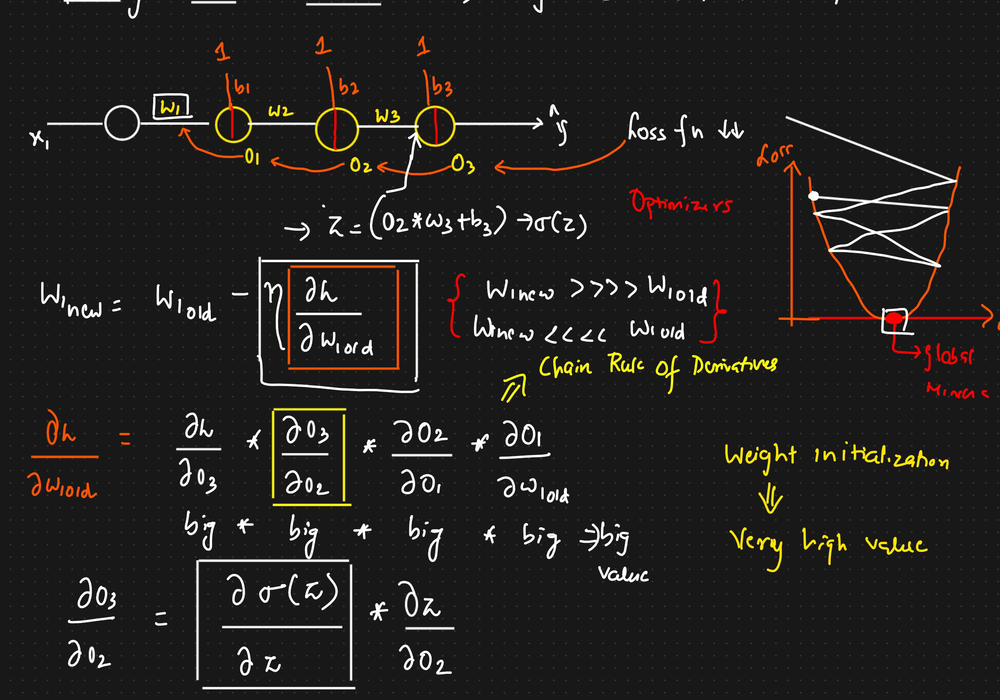

# 🟢 Exploding Gradient Problem

* <mark style="color:purple;background-color:purple;">**Lets say we want to update w1**</mark>
* <mark style="color:purple;background-color:purple;">**Lets expand derivative of o3 with o2**</mark>
* <mark style="color:purple;background-color:purple;">**o3 is sigmoid of z ⇒ so this can be expanded using chain rule**</mark>
* <mark style="color:purple;background-color:purple;">**if the weight initialized was very high then we will be getting very big gradients**</mark>
*   <mark style="color:purple;background-color:purple;">**Due to this huge weight updation will occur, and we might not reach global minima**</mark>

    <figure><figcaption></figcaption></figure>
*

    <figure><figcaption></figcaption></figure>
