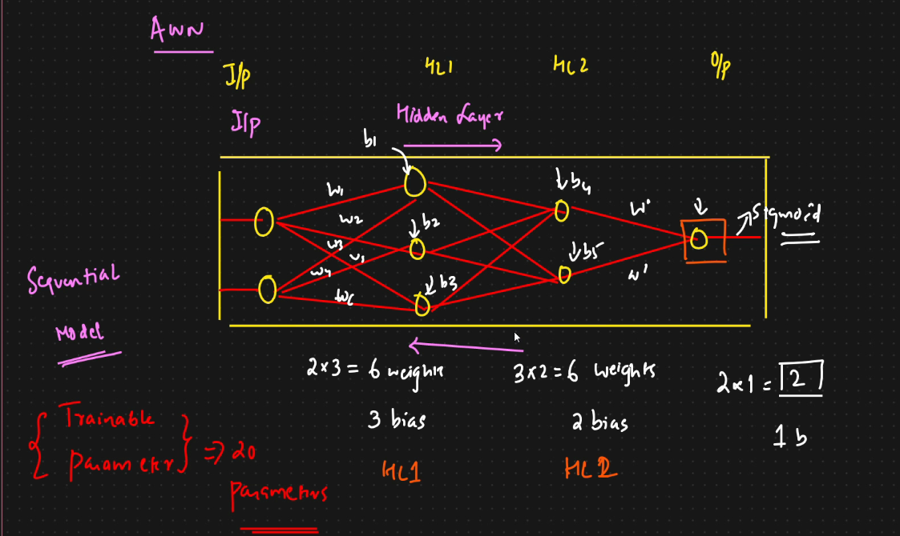

# 🟢 Step by Step training with ANN

<mark style="color:purple;background-color:purple;">**Steps:**</mark>

* <mark style="color:purple;background-color:purple;">**Build the network**</mark>
* <mark style="color:purple;background-color:purple;">**Compile by passing optimizer, loss, accuracy**</mark>
* <mark style="color:purple;background-color:purple;">**Define earlystopping by specifying patience etc**</mark>
* <mark style="color:purple;background-color:purple;">**mode.fit by passing data, callbacks and epochs**</mark>
*   <mark style="color:purple;background-color:purple;">**Save the model as .h5**</mark>

    <figure><figcaption></figcaption></figure>

```python
import tensorflow as tf
from tensorflow.keras.models import Sequential
from tensorflow.keras.layers import Dense
from tensorflow.keras.callbacks import EarlyStopping,TensorBoard
import datetime

(X_train.shape[1],)

## Build Our ANN Model
model=Sequential([
    Dense(64,activation='relu',input_shape=(X_train.shape[1],)), ## HL1 Connected wwith input layer
    Dense(32,activation='relu'), ## HL2
    Dense(1,activation='sigmoid')  ## output layer
]
)

model.summary()

import tensorflow
opt=tensorflow.keras.optimizers.Adam(learning_rate=0.01)
loss=tensorflow.keras.losses.BinaryCrossentropy()
loss

## compile the model
model.compile(optimizer=opt,loss="binary_crossentropy",metrics=['accuracy'])

## Set up the Tensorboard
from tensorflow.keras.callbacks import EarlyStopping,TensorBoard

log_dir="logs/fit/" + datetime.datetime.now().strftime("%Y%m%d-%H%M%S")
tensorflow_callback=TensorBoard(log_dir=log_dir,histogram_freq=1)

## Set up Early Stopping
early_stopping_callback=EarlyStopping(monitor='val_loss',patience=10,restore_best_weights=True)

### Train the model
history=model.fit(
    X_train,y_train,validation_data=(X_test,y_test),epochs=100,
    callbacks=[tensorflow_callback,early_stopping_callback]
)

model.save('model.h5')

## Load Tensorboard Extension
%load_ext tensorboard

%tensorboard --logdir logs/fit
```
